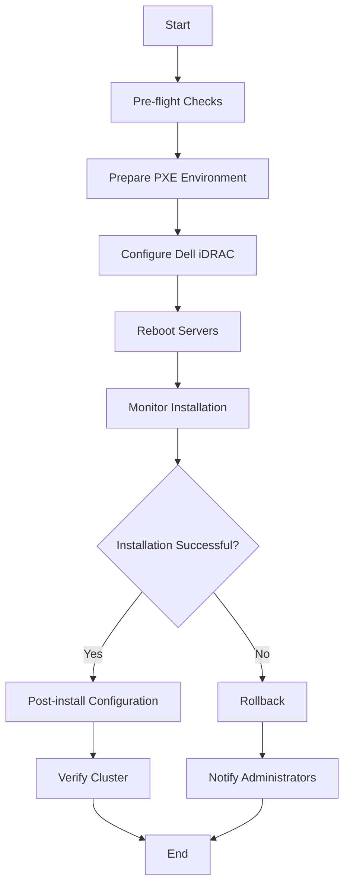

# Harvester Installation Playbook

## Table of Contents

- [Harvester Installation Playbook](#harvester-installation-playbook)
  - [Table of Contents](#table-of-contents)
  - [Introduction](#introduction)
  - [System Requirements](#system-requirements)
    - [Hardware Requirements](#hardware-requirements)
      - [Minimum](#minimum)
      - [Recommended](#recommended)
    - [Supported Dell Server Models](#supported-dell-server-models)
    - [iDRAC Requirements](#idrac-requirements)
  - [Software Prerequisites](#software-prerequisites)
  - [Installation Process Overview](#installation-process-overview)
  - [Playbook Structure](#playbook-structure)
  - [Configuration](#configuration)
    - [Inventory](#inventory)
    - [Variables](#variables)
  - [Usage](#usage)
  - [Customization](#customization)
  - [Troubleshooting](#troubleshooting)

## Introduction

This Ansible playbook automates the installation of Harvester on Dell servers using iPXE boot and iDRAC for management. Harvester is an open-source hyper-converged infrastructure (HCI) software built on Kubernetes.

**Version**: 1.0.0

**Supported Harvester Versions**: v1.1.0 - v1.3.1

**Last Updated**: 2023-06-15

## System Requirements

### Hardware Requirements

#### Minimum

- CPU: 4 cores
- RAM: 32 GB
- Storage: 120 GB SSD for OS, 200 GB SSD for data
- Network: 1 Gbps NIC

#### Recommended

- CPU: 16 cores
- RAM: 128 GB
- Storage: 240 GB NVMe for OS, 1 TB NVMe for data
- Network: 10 Gbps NIC

### Supported Dell Server Models

- PowerEdge R640
- PowerEdge R740
- PowerEdge R750
- PowerEdge R840
- PowerEdge R940

### iDRAC Requirements

- iDRAC version: 4.40.00.00 or higher
- iDRAC Enterprise license

## Software Prerequisites

- Ansible 2.9 or newer
- Python 3.6 or newer
- `dellemc.openmanage` Ansible collection
- `containers.podman` Ansible collection
- `community.general` Ansible collection

## Installation Process Overview



## Playbook Structure

```text
harvester-install/
├── ansible.cfg
├── inventory.ini
├── playbook.yml
├── README.md
├── group_vars/
│   └── all.yml
└── roles/
    └── harvester_install/
        ├── tasks/
        │   ├── main.yml
        │   ├── prepare_pxe.yml
        │   ├── configure_pxe_boot.yml
        │   ├── install_harvester.yml
        │   ├── monitor_installation.yml
        │   ├── post_install_verification.yml
        │   ├── cleanup.yml
        │   └── rollback.yml
        ├── handlers/
        │   └── main.yml
        ├── templates/
        │   ├── harvester.ipxe.j2
        │   ├── harvester.yaml.j2
        │   └── dnsmasq.conf.j2
        ├── files/
        │   └── data/
        └── vars/
            └── main.yml
```

## Configuration

### Inventory

Define your Dell servers in the `inventory.ini` file:

```ini
[idrac_hosts]
192.168.1.101 ansible_host=192.168.1.101
192.168.1.102 ansible_host=192.168.1.102
192.168.1.103 ansible_host=192.168.1.103
192.168.1.104 ansible_host=192.168.1.104
```

### Variables

Key variables are defined in `group_vars/all.yml`:

```yaml
pxe_harvester_version: "v1.3.1"
pxe_harvester_mgmt_interface: "eno1"
pxe_harvester_vip: "10.0.20.20"
pxe_harvester_osdisk: "/dev/sda"
pxe_harvester_datadisk: "/dev/sdb"
```

Adjust these variables according to your environment.

## Usage

To run the playbook:

```bash
ansible-playbook -i inventory.ini playbook.yml
```

Additional options:

- Verbose mode: Add `-v`, `-vv`, or `-vvv`
- Limit to specific hosts: Add `--limit hostname1,hostname2`
- Use vault: Add `--ask-vault-pass`
- Pass extra variables: Add `-e "variable_name=value"`
- Check mode (dry run): Add `--check`
- Run specific tags: Add `--tags "tag1,tag2"`

Example with multiple options:

```bash
ansible-playbook -i inventory.ini playbook.yml -v --limit harvester_nodes --ask-vault-pass -e "pxe_harvester_version=v1.3.1" --tags "preparation,installation"
```

## Customization

To customize the installation process:

1. Modify variables in `group_vars/all.yml` for global changes.
2. Create host-specific variable files in `host_vars/` for per-server customization.
3. Add or modify tasks in the role's task files to include additional steps.
4. Update templates in the `templates/` directory to customize configuration files.

## Troubleshooting

Common issues and their solutions:

1. **iDRAC Connectivity Issues**
   - Ensure iDRAC IP is correct in inventory
   - Verify network connectivity
   - Check iDRAC credentials

2. **PXE Boot Failures**
   - Verify DHCP server is configured correctly
   - Ensure iPXE files are accessible
   - Check network switch configuration for PXE/DHCP

3. **Installation Hangs**
   - Increase verbosity for more detailed logs
   - Check server console for error messages
   - Verify hardware meets minimum requirements

4. **Post-Installation Cluster Formation Issues**
   - Verify network connectivity between nodes
   - Check Harvester logs for errors
   - Ensure all nodes have the correct time set

5. **Performance Issues**
   - Verify BIOS settings are optimized
   - Check for resource contention (CPU, memory, disk I/O)
   - Monitor network performance between nodes

For more detailed troubleshooting:

- Check the Ansible log file specified in `ansible.cfg`
- Review iDRAC logs for hardware-related issues
- Examine Harvester logs on the installed nodes
